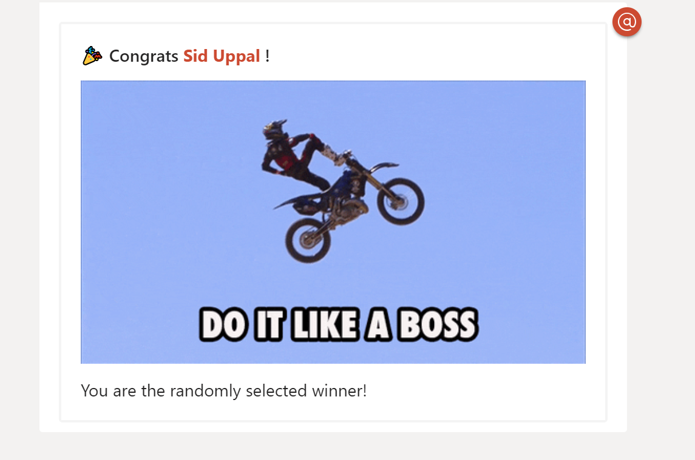

# Randomly
Randomly is a simple yet useful Teams bot that shows how to use mentions in cards.

You can nudge it in a team or group-chat to choose a member at random to carry out some task.


Randomly chooses one of the human roster members at random and declares them the winner.



## So what can you learn from it? 
There're other samples out there that cover how to build a Teams bot, how to fetch members, how to handle a user's message and respond, so I won't mention any of that. 

#### The most interesting thing about this sample is how it uses a [Fluid template](https://github.com/sebastienros/fluid) to dynamically generate an Adaptive Card and bind it to a data-model 💪


### Ready to dive in?! Buckle up! 🏎

Here's what the code for reading up the AnnouncementCard and processing the template in it looks like:

```CSharp
        public static string GetAnnouncementCard(IHostingEnvironment env, AnnouncementCardModel model)
        {
            if (env == null)
            {
                throw new ArgumentNullException(nameof(env));
            }
            
            if (model == null)
            {
                throw new ArgumentNullException(nameof(model));
            }

            // Slurp up the card using File IO
            var cardsDirectory = Path.Combine(env.ContentRootPath, "Cards");
            var cardJsonFilePath = Path.Combine(cardsDirectory, $"AnnouncementCard.fluid");
            var cardBody = File.ReadAllText(cardJsonFilePath);

            if (FluidTemplate.TryParse(cardBody, out var template))
            {
                var context = new TemplateContext();

                // Register the object that is used in the Fluid template for the card
                context.MemberAccessStrategy.Register<AnnouncementCardModel>();
                context.SetValue("model", model);
                context.MemberAccessStrategy.Register<AnnouncementCardWinner>();

                // Voila, render the card with Fluid template processed
                cardBody = template.Render(context);
            }

            return cardBody;
        }
```
I added some comments above to explain what's happening, but the key line is the call to `template.Render`.

The `AnnouncementCard.fluid` is interesting as well.

```
{
  "type": "AdaptiveCard",
  "body": [
    {
      "type": "Container",
      "items": [
        {
          "type": "TextBlock",
          "size": "Medium",
          "weight": "Bolder",
          "text": "🎉 Congrats <at>{{ winner.Name }}</at> !"
        }
      ]
    },
    {
      "type": "Container",
      "items": [
        {
          "type": "Image",
          "url": "{{ model.ImageUrl }}",
          "altText": ""
        },
        {
          "type": "TextBlock",
          "text": "You are the randomly selected winner!",
          "wrap": true
        }
      ]
    }
  ],
  "msteams": {
    "entities": [
       {
        "type": "mention",
        "text": "<at>{{ winner.Name }}</at>",
        "mentioned": {
          "id": "{{ winner.Id }}",
          "name": "{{ winner.Name}}"
        }
      } 
         ,{
        "type": "mention",
        "text": "<at>{{ winner.Name }}</at>",
        "mentioned": {
          "id": "{{ winner.Id }}",
          "name": "{{ winner.Name}}"
        }
      } 
    ]
  },
  "$schema": "http://adaptivecards.io/schemas/adaptive-card.json",
  "version": "1.0"
}
```

It's a pretty standard Adaptive Card but with some Fluid magic sprinkled in. Let's break it down!


There's code elsewhere in the bot which chooses one of 5 GIFs at random to show with the winner announcement. That GIF url is passed to template processing via the `ImageUrl` property of `AnnouncementCardModel` class. To have it replaced in the Fluid template, we just summon it like so:

`{{ model.ImageUrl }}`

Easy, right? 😎 Well, now it gets more interesting. Let's assume there can be multiple random winners and that's useful for showing the next super interesting concept, and the real power of Fluid.

You can iterate over an array of objects in the template using `for`:

```

....hey Fluid, repeat whatever's in here...

```

Now that's very useful for us. We use it to mention all the individuals who were chosen at random.

```
 {
      "type": "Container",
      "items": [
        {
          "type": "TextBlock",
          "size": "Medium",
          "weight": "Bolder",
          "text": "🎉 Congrats <at>{{ winner.Name }}</at> !"
        }
      ]
    }
```
Note the `winner in model.Winners` piece above; that's key.

Now that's great so far, but to fully get mentions to work, you need to populate the mention entities as well. This is where it gets interesting and a little tricky. That's because to generate synatically valid JSON we need to account for the commas (',').

Well, Fluid supports operators on arrays and they come to our rescue.

This is how we populate the entities piece of the AdaptiveCard.

```
  "msteams": {
    "entities": [
       {
        "type": "mention",
        "text": "<at>{{ winner.Name }}</at>",
        "mentioned": {
          "id": "{{ winner.Id }}",
          "name": "{{ winner.Name}}"
        }
      } 
         ,{
        "type": "mention",
        "text": "<at>{{ winner.Name }}</at>",
        "mentioned": {
          "id": "{{ winner.Id }}",
          "name": "{{ winner.Name}}"
        }
      } 
    ]
  },
```
The thing to note here is the `limit:1` and `offset:1` piece. So what this lets us do, is ask Fluid to spit out the mention for the first element in the `winners` array first (aka `limit 1`), and then process elements in the winners skipping past 1st element (aka `offset:1`) **putting a comma** before each of them. Bingo, synatically valid JSON!

That's it!

Download the full sample and check it out!
